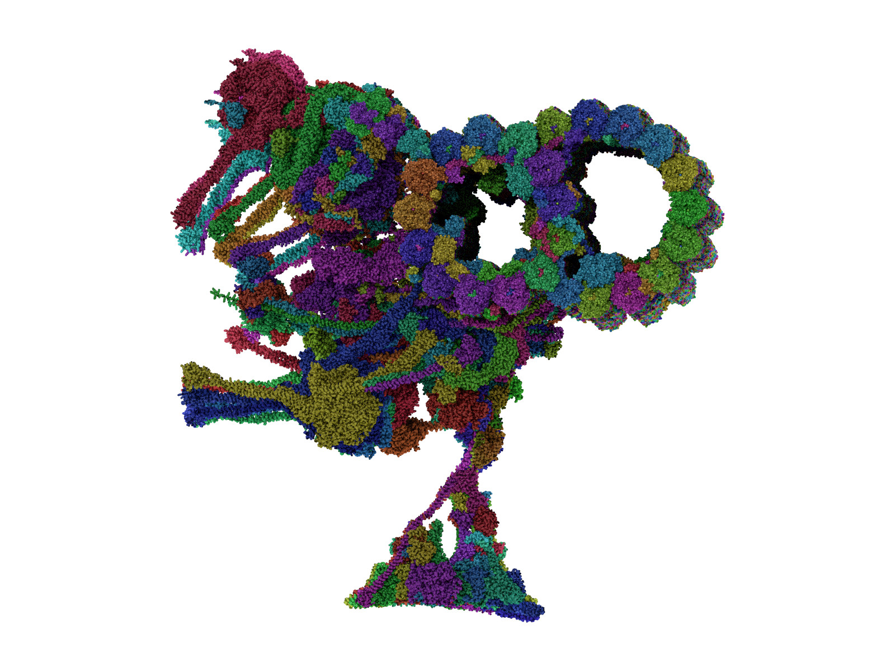
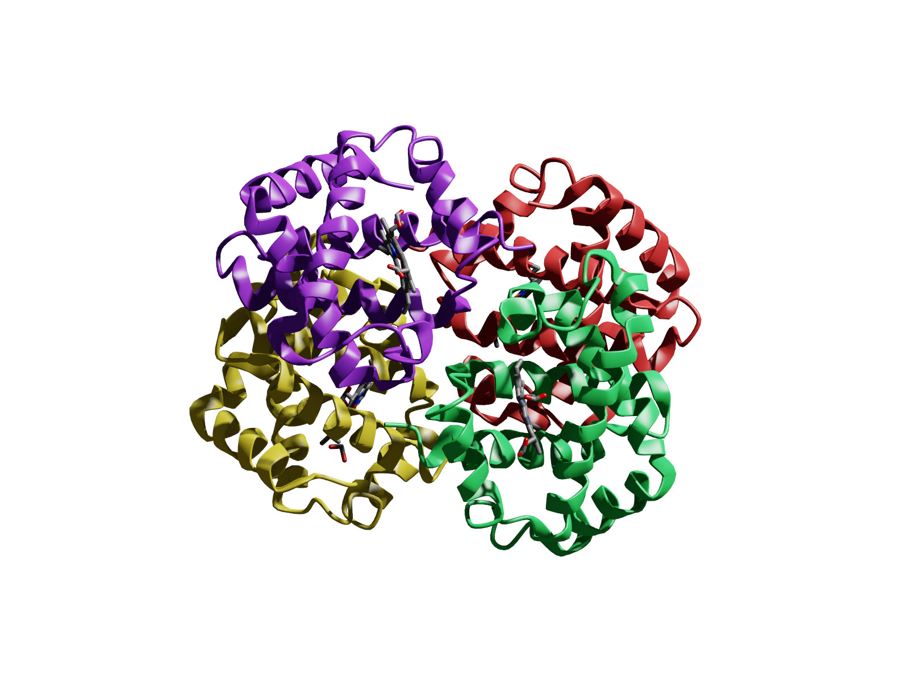
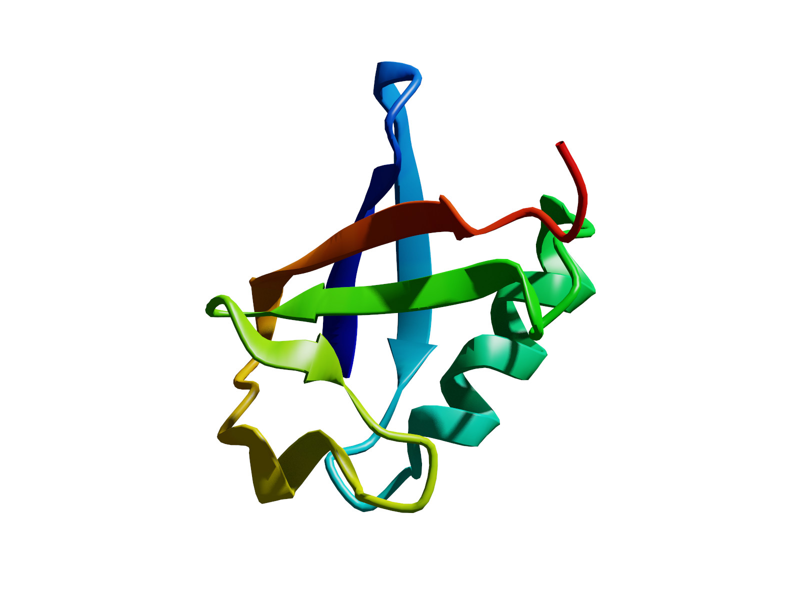
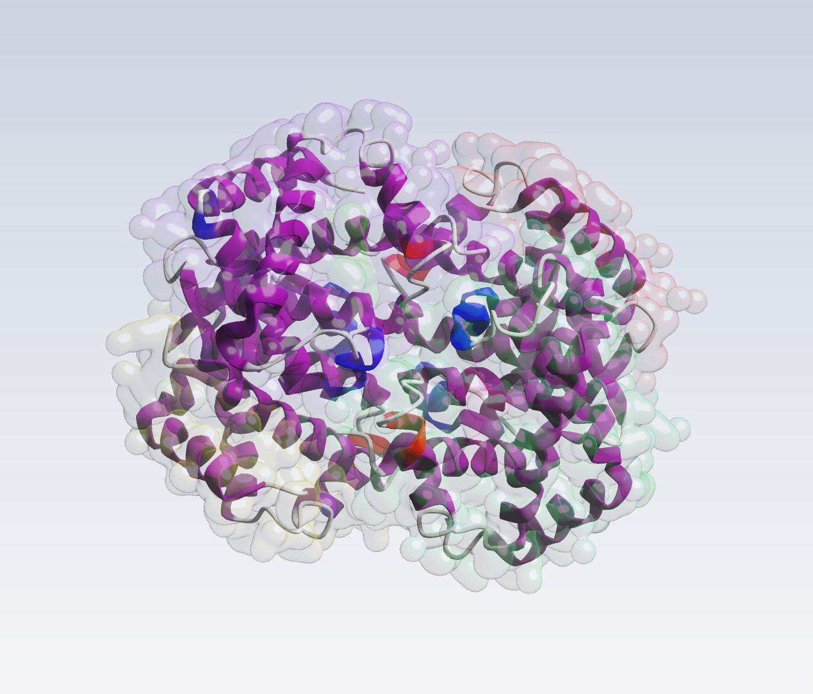
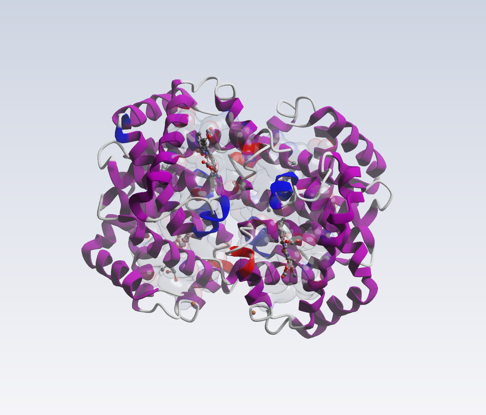
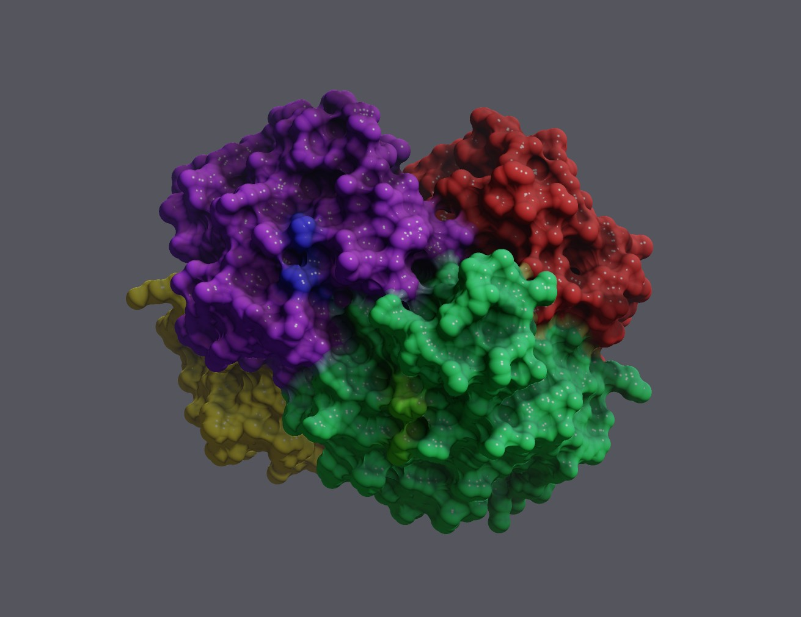

# Gallery

Each image is made by the command line under it, so you can make it
again (paths shortened).

## Path-traced

8GLV, 3,968,189 atoms, coloured by chain; 1600x1200, 64 samples per pixel,
3.2 s on an RTX 3060 Laptop, loading included in under 6 s.
`load 8GLV.cif; color chain; lighting soft; background #ffffff; view zoom 0.55; render 8glv.jpg 1600x1200 64`

Hemoglobin (4HHB): cartoon by chain, hemes as sticks; 128 samples, 1.2 s.
`load 4HHB.cif; rep cartoon; color chain; addrep sticks resname HEM; color element; lighting full; background #ffffff; render hemoglobin.jpg 1600x1200 128`

Ubiquitin (1UBQ): cartoon in rainbow order, N- to C-terminus; 0.7 s.
`load 1UBQ.cif; rep cartoon; color rainbow; lighting full; background #ffffff; view zoom 0.7; render ubiquitin.jpg 1600x1200 128`

## In the viewport

A cartoon inside a glass Gaussian surface, the Chalk material and
shadows, drawn live.

Several representations of one structure: a cartoon, and the residues
around each heme as sticks.

The analytic solvent-excluded surface of hemoglobin, coloured by chain.
